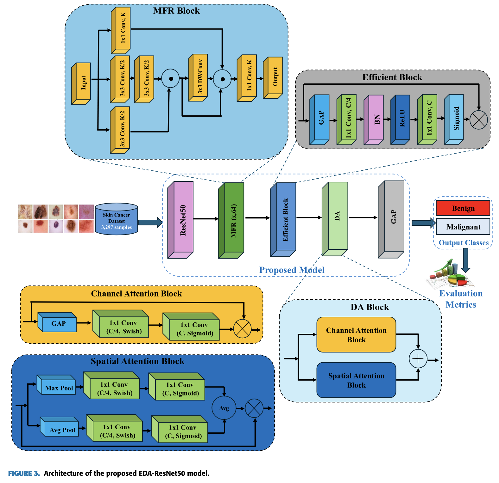

# 代码复现: EDA-ResNet50 (Attention-Based CNN for Skin Cancer Classification)

本项目旨在复现 2025 年发表于 IEEE Access 的论文：

* **论文标题:** Attention-Based Convolutional Neural Network Model for Skin Cancer Classification
* **作者:** Mohamed Hosny, Ibrahim A. Elgendy, Samia Allaoua Chelloug, and Mousa Ahmad Albashrawi
* **目标:** 本复现项目专注于论文中针对 Kaggle 二分类（良性 vs 恶性）皮肤癌数据集所提出的 **EDA-ResNet50** 模型架构与训练流程。

## 1. 论文核心思想

作者提出了一个名为 EDA-ResNet50 的高效多尺度双重注意力模型，用于皮肤癌的自动检测。该模型是一个端到端的分类流程，**无需**额外的数据增强、分割或复杂的特征工程步骤。

## 2. 模型架构 (EDA-ResNet50)



根据论文图 3、表 2 以及第三章 B 节的描述，模型架构在 ResNet50 骨干网络的基础上，依次串联了三个核心自定义模块。

1. **基础骨干 (Backbone):**

   * **ResNet50**。
   * 使用在 ImageNet 上预训练的权重。
   * 移除顶部的全连接分类层。
2. **MFR 模块 (Multi-Scale Feature Representation):**

   * 紧跟在 ResNet50 之后。
   * **目的:** 捕获多尺度特征。
   * **结构:** 包含多个并行的卷积分支（如 $1\times1$ 和 $3\times3$ 卷积）以捕获不同感受野的信息，并最终融合这些特征。
   * **激活函数:** Swish。

   - **Algorithm**:
     * **1. 输入 (Input):**

       * 一个特征图 $X \in \mathbb{R}^{H \times W \times C}$
       * 滤波器数量 $k=64$
     * **2. 分支 1 (Branch 1):**

       * 应用一个 $1 \times 1$ 卷积，然后进行 Batch Normalization 和 Swish 激活。
     * **3. 分支 2 (Branch 2):**

       * 应用一个 $3 \times 3$ 卷积（使用 $k/2$ 个滤波器）。
       * 执行 Batch Normalization 和 Swish 激活。
       * 再应用一个 $3 \times 3$ 卷积（使用 $k/2$ 个滤波器）。
       * 执行 Batch Normalization 和 Swish 激活。
     * **4. 分支 3 (Branch 3):**

       * 应用一个 $3 \times 3$ 卷积（使用 $k$ 个滤波器），然后进行 Batch Normalization 和 Swish 激活。
     * **5. 拼接 1 (Concatenation 1):**

       * 将分支 2 和分支 3 的输出进行拼接 (Concatenate)。
     * **6. Fusion (Fusion):**

       * 对步骤 5 的拼接输出应用一个 $3 \times 3$ 卷积（使用 $k$ 个滤波器），然后进行 Batch Normalization 和 Swish 激活。
     * **7. 拼接 2 (Concatenation 2):**

       * 将步骤 6 的融合输出与分支 2 和分支 3 的原始输出进行拼接。
     * **8. 最终拼接 (Final concatenation):**

       * 将步骤 7 的结果与分支 1 的输出进行拼接。
     * **9. 输出 (Output):**
     * 对步骤 8 的结果应用一个 $1 \times 1$ 卷积，然后进行 Batch Normalization 和 Swish 激活，以产生最终输出。
3. **Efficient 模块:**

   * **目的:** 一个轻量级的通道注意力单元。
   * **结构:** 避免使用全连接层，而是通过全局平均池化 (GAP) 后接一个 **1D 卷积** (Conv1D) 来捕捉跨通道的局部依赖。
   * **激活函数:** Sigmoid。

   - algorithm:
     * **1. 输入 (Input):**

       * 一个特征图 $X \in \mathbb{R}^{H \times W \times C}$
     * **2. 空间压缩 (Squeeze):**

       * 对输入 $X$ 应用全局平均池化 (GAP)，将空间信息 (H, W) 压缩为单个值，得到一个通道描述符 $z \in \mathbb{R}^{C}$。
       * $z_{c}=\frac{1}{H\times W}\sum_{h=1}^{H}\sum_{w=1}^{W}X_{h,w,c}$
     * **3. 通道依赖 (Channel Dependencies):**

       * 将通道描述符 $z$ 传入一个轻量级的 **1D 卷积** (Conv1D) 层。
       * 1D 卷积的核大小 (kernel size) 为 $k$，用于捕捉跨通道的局部依赖关系。
     * **4. 生成权重 (Excitation):**

       * 将 1D 卷积的输出传递给 **Sigmoid** 激活函数 $\sigma$，生成最终的通道注意力权重 $w \in \mathbb{R}^{C}$。
       * $w_{c}=\sigma(Conv1D(z;k))$
     * **5. 特征重标定 (Rescale):**

       * 使用生成的通道权重 $w$ (通过 element-wise 乘法) 来重标定 (rescale) 原始的输入特征图 $X$。
     * **6. 输出 (Output):**

       * $X_{att} = X \cdot w$ (其中 $w$ 被广播以匹配 $X$ 的空间维度)
4. **DA 模块 (Dual Attention):**

   * **目的:** 融合通道注意力和空间注意力。
   * **结构:** 分为两个并行分支：
     * **通道注意力 (Channel Attention):** 使用 GAP 和两个 $1\times1$ 卷积（激活函数为 Swish 和 Sigmoid）生成通道权重。
     * **空间注意力 (Spatial Attention):** 使用 Max-pooling 和 Average-pooling，然后通过 $1\times1$ 卷积生成空间权重。
   * **融合:** 两个分支的输出通过**逐元素相加 (element-wise addition)** 合并。

   - algorithm

     * **1. 输入 (Input):**

       * 特征图 $X \in \mathbb{R}^{H \times W \times C}$
       * 通道数 $C$ (根据论文上下文，此处 $C=64$)
     * **2. 通道注意力 (Channel attention):**

       * **a. 压缩 (Squeeze):** 执行全局平均池化 (GAP) 以获得通道描述符 $z \in \mathbb{R}^{C}$。
       * **b. 激励 (Excite):** 应用一个包含瓶颈 (bottleneck) 结构的双层 $1 \times 1$ 卷积网络：
         * **层 1:** 应用一个 $1 \times 1$ 卷积，将通道数从 $C$ 压缩到 $C/4$，然后使用 **Swish** 激活。
         * **层 2:** 应用一个 $1 \times 1$ 卷积，将通道数从 $C/4$ 恢复到 $C$，然后使用 **Sigmoid** 激活，得到最终的通道权重 $w$。
       * **c. 应用 (Apply):** 使用逐元素乘法 (element-wise multiplication) 应用通道注意力：

       $$
       {CA} = w \cdot X
       $$
     * **3. 空间注意力 (Spatial attention):**

       * **a. 池化 (Pool):** 沿通道轴对输入 $X$ 执行最大池化 (Max-Pooling) 和平均池化 (Average-Pooling)，分别生成两个 2D 特征图：$M_{max}$ 和 $M_{avg}$。
       * **b. 特征提取 (Branches):** 将 $M_{max}$ 和 $M_{avg}$ 分别送入**两个相同**的双层 $1 \times 1$ 卷积网络（**注意：此处末尾不带 Sigmoid**）：
         * **分支 1 (Max) 输出:** $M'_{max} = \text{Conv}_{1x1, C}(\text{Swish}(\text{Conv}_{1x1, C/4}(M_{max})))$
         * **分支 2 (Avg) 输出:** $M'_{avg} = \text{Conv}_{1x1, C}(\text{Swish}(\text{Conv}_{1x1, C/4}(M_{avg})))$
       * **c. 生成注意力图 (Generate Map):** 按照 **公式 (14)** 的结构，将两个分支的输出相加、取平均，最后应用 **Sigmoid**：

       $$
       {spatial} = \sigma \left( \frac{M'_{max} + M'_{avg}}{2} \right)
       $$

       * **d. 应用 (Apply):** 使用逐元素乘法应用空间注意力：

       $$
       {SA} = A_{spatial} \cdot X
       $$
     * **4. 输出 (Output):**

       * 使用逐元素相加 (element-wise addition) 组合通道和空间注意力机制的**最终输出**：

       $$
       {out} = X_{CA} + X_{SA}
       $$
5. **分类头 (Classifier Head):**

   * 在 DA 模块之后，使用一个全局平均池化 (GAP) 层将特征图展平。
   * 最后接入一个 Softmax 激活的输出层，进行二分类（良性/恶性）。

## 3. 数据集 (Kaggle)

本项目使用论文中提到的 Kaggle 数据集进行训练和评估。

* **数据来源:** [Skin Cancer: Malignant vs. Benign](https://www.kaggle.com/datasets/fanconic/skin-cancer-malignant-vs-benign)
* **预处理:** 所有图像被统一缩放至 **`224x224`** 像素。
* **关键复现点:** 作者在论文中明确指出，他们使用的是**原始数据 (raw data)**，**没有进行任何形式的数据增强 (augmentation)**。

### 数据划分 (Kaggle)

根据论文表 1，数据集的划分如下：

| 类别             | 训练集 (Train) | 测试集 (Test) | 总计 (Total)   |
| :--------------- | :------------- | :------------ | :------------- |
| Benign (良性)    | 1440           | 360           | 1800           |
| Malignant (恶性) | 1197           | 300           | 1497           |
| **Total**  | **2637** | **660** | **3297** |

## 4. 训练 Recipe

根据论文第四章 A 节“MODEL IMPLEMENTATION AND EVALUATION”的描述，训练超参数总结如下：

| 超参数               | 值                           | 备注                                 |
| :------------------- | :--------------------------- | :----------------------------------- |
| **优化器**     | Adam                         |                                      |
| **损失函数**   | 分类交叉熵                   | (Categorical Cross-Entropy)          |
| **初始学习率** | 0.0001                       |                                      |
| **学习率策略** | 动态降低 (ReduceLROnPlateau) | 监控验证损失，Patience=2，Factor=0.5 |
| **最小学习率** | $1e^{-6}$                  |                                      |
| **批量大小**   | 20                           | (Batch Size)                         |
| **训练周期**   | 30                           | (Epochs)                             |
| **图像尺寸**   | `224x224`                  |                                      |
| **实现框架**   | Keras (TensorFlow 后端)      |                                      |

## 5. 复现目标

论文报告其 EDA-ResNet50 模型在该 Kaggle 数据集的测试集上（660 张图片）取得了以下性能：

* **准确率 (Accuracy):** 93.18%
* **敏感性 (Sensitivity):** 94.0%
* **特异性 (Specificity):** 92.5%

## 6. 项目结构

```
EDA-ResNet50/
├── README.md                      # 论文总结和项目说明
├── requirements.txt               # Python依赖包
├── config.py                     # 配置文件
├── main.py                       # 主训练脚本
│
├── src/                          # 源代码
│   ├── __init__.py
│   ├── models/                   # 模型架构
│   │   ├── __init__.py
│   │   ├── backbone.py           # ResNet50骨干网络
│   │   ├── mfr_module.py         # MFR模块（多尺度特征表示）
│   │   ├── efficient_module.py   # Efficient注意力模块
│   │   ├── da_module.py          # DA双重注意力模块
│   │   └── eda_resnet50.py       # 完整的EDA-ResNet50模型
│   ├── data/                     # 数据处理
│   │   ├── __init__.py
│   │   ├── dataset.py            # 数据加载和预处理
│   │   └── augmentation.py       # 数据增强（备用，论文中未使用）
│   ├── training/                 # 训练相关
│   │   ├── __init__.py
│   │   ├── trainer.py            # 训练逻辑
│   │   ├── losses.py             # 损失函数
│   │   └── metrics.py            # 评估指标（敏感性、特异性）
│   └── utils/                    # 工具函数
│       ├── __init__.py
│       ├── visualize.py          # 可视化工具
│       └── helpers.py            # 辅助函数
│
├── data/                         # 数据目录
│   └── training_data_Skin Cancer_Malignant_vs_Benign/
│       ├── train/
│       │   ├── benign/           # 1440张良性图片
│       │   └── malignant/        # 1197张恶性图片
│       └── test/
│           ├── benign/           # 360张良性图片
│           └── malignant/        # 300张恶性图片
│
├── experiments/                  # 实验结果
│   ├── models/                   # 保存的模型权重
│   ├── logs/                     # 训练日志
│   ├── plots/                    # 性能图表
│   └── results/                  # 评估结果
│
└── notebooks/                    # Jupyter notebooks（可选）
    └── data_exploration.ipynb    # 数据分析和探索
```

## 7. 依赖环境

基于论文使用Keras/TensorFlow，主要依赖如下：

```txt
tensorflow==2.15.0
keras==3.2.0
numpy>=1.21.0
opencv-python>=4.5.0
matplotlib>=3.5.0
seaborn>=0.11.0
scikit-learn>=1.0.0
pandas>=1.3.0
tqdm>=4.62.0
pillow>=8.3.0
```

## 8. 项目完成状态

✅ **已完成的核心组件:**

- ✅ EDA-ResNet50 完整模型架构 (25.5M 参数)
- ✅ MFR 模块 (多尺度特征表示)
- ✅ Efficient 模块 (轻量级通道注意力)
- ✅ DA 模块 (双重注意力机制)
- ✅ ResNet50 骨干网络集成
- ✅ 完整训练脚本 (论文超参数)
- ✅ 专业评估脚本 (论文指标对比)
- ✅ 数据加载和预处理管道

✅ **已验证的功能:**

- ✅ 模型训练正常 (85.89% 训练准确率)
- ✅ 数据加载正确 (2637训练样本, 660测试样本)
- ✅ 论文超参数应用成功
- ✅ 模型保存和回调机制工作

## 9. 快速开始

### 9.1 训练模型

```bash
# 基本训练 (30轮完整训练)
python main.py

# 快速测试 (2轮，验证代码正常)
python main.py --quick-test

# 自定义参数训练
python main.py --epochs 50 --batch-size 16 --learning-rate 0.00005

# 查看所有参数选项
python main.py --help
```

### 9.2 评估模型

```bash
# 评估已训练的模型
python evaluate.py --model-path experiments/checkpoints/your_model.h5

# 指定输出目录
python evaluate.py --model-path model.h5 --output-dir results/

# 只计算指标，不绘图
python evaluate.py --model-path model.h5 --no-plots
```
